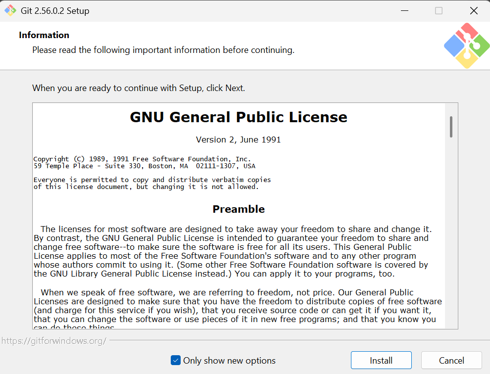

# PRAKTIKUM MINGGU 01
Laporan praktikum minggu pertama 
Topik : Pengenalan git, instalansi github serta mengkonfigurasinya

# 1. PENDAHULUAN
## TUJUAN PRAKTIKUM
Tujuan dari praktikum ini adalah untuk memahami dan melakukan proses instalasi Git pada sistem operasi Windows, mengetahui cara memeriksa keberhasilan instalasi Git, serta memahami penggunaan dasar Git melalui Command Prompt atau Git Bash.

## DASAR TEORI
Git merupakan sistem kontrol versi (version control system) yang digunakan untuk mengelola dan mencatat perubahan pada file atau proyek. Git membantu pengguna menyimpan riwayat perubahan sehingga setiap versi dari suatu proyek dapat dikelola dengan lebih terstruktur. 
Git dapat digunakan melalui antarmuka grafis (GUI) maupun melalui Command Line Interface (CLI), seperti Git Bash, Command Prompt, dan PowerShell. Pada sistem operasi Windows, Git dapat diinstal menggunakan installer Git atau melalui perintah winget. 
Setelah Git berhasil diinstal, keberhasilan instalasi dapat diperiksa menggunakan perintah git --version. Jika terminal menampilkan nomor versi Git, maka Git telah berhasil terpasang dan siap digunakan.  
Dalam penggunaannya, Git memiliki beberapa perintah dasar seperti git init untuk membuat repository, git add untuk menambahkan perubahan ke staging area, git commit untuk menyimpan perubahan ke dalam riwayat Git, serta git push untuk mengirim perubahan ke repository online seperti GitHub. 

# 2. PRAKTIKUM
## 1. Instalansi Git

Pada gambar tersebut merupakan tahap awal proses instalasi Git versi 2.56.0.2 pada sistem operasi Windows. Pada tahap ini ditampilkan informasi mengenai GNU General Public License (GPL) yang digunakan oleh Git. Untuk melanjutkan proses instalasi, pengguna dapat membaca informasi lisensi kemudian menekan tombol Install. Tahap ini menunjukkan bahwa installer Git sudah siap untuk melakukan proses pemasangan ke komputer.

## 2. Pemeriksaan Instalansi Git
 
Pada tahap pemeriksaan instalasi, dilakukan pengecekan untuk memastikan Git telah berhasil terpasang pada komputer. Pemeriksaan dilakukan melalui Git Bash dengan menjalankan perintah git --version. Hasil yang ditampilkan berupa versi Git yang terpasang, sehingga dapat disimpulkan bahwa Git telah berhasil diinstal dan siap digunakan.

## 3. Konfigurasi Git
 
Pada tahap konfigurasi Git dilakukan pengaturan identitas pengguna berupa nama dan email menggunakan perintah git config --global. Konfigurasi ini digunakan untuk memberikan identitas pada setiap perubahan atau commit yang dibuat. Setelah konfigurasi dilakukan, pengaturan diperiksa menggunakan perintah git config --list untuk memastikan nama dan email telah tersimpan dengan benar.

## 4. Mengelola Repo Sendiri di Account Sendiri
Langkah-langkah: 
1. Buat repo kosong di Github, public maupun private
2. Clone repo kosong tersebut di komputer lokal
3. Perintah berikutnya terkait dengan perubahan repo serta sinkronisasi antara GitHub dengan lokal.

### Membuat Repo
1. Klik tanda + pada bagian atas setelah login, pilih New repository 
 
Pembuatan repository di GitHub dimulai dengan memilih menu New repository dari ikon + di bagian atas setelah login. Selanjutnya, isi detail proyek seperti nama, deskripsi, lisensi, serta visibilitas (Public atau Private).

2. Isikan nama, keterangan, serta lisensi. Jika dikehendaki, bisa membuat repo Private 
   
   Untuk bagian ini saya lupa screenshot saat membuat repositori, jadi saya buat diterminal command prompt. 

3. Klik Create Repository
  Setelah menekan tombol Create Repository, GitHub akan membuat repository baru sesuai konfigurasi yang ditentukan. Jika dibuat menggunakan pilihan default (tanpa mengaktifkan README, .gitignore, atau LICENSE), GitHub akan menghasilkan repository kosong dan menampilkan halaman petunjuk awal. Halaman tersebut     berisi alamat URL repository dengan format : 
[https://github.com/username/nama-repo](https://github.com/username/nama-repo)) yang siap digunakan untuk proses cloning ke komputer lokal. 
   

### Clone Repo
Proses clone digunakan untuk menduplikasikan remote repository dari GitHub ke komputer lokal. Langkah ini dilakukan dengan menjalankan perintah git clone <URL-repo> pada terminal atau command line. 

### Mengelola Repo

